# Week 6: Azure Data Factory ETL Project

In this task, we build an **ETL pipeline using Azure Data Factory (ADF)** that extracts data from:

* An **on-premise SQL Server**
* An **SFTP server**

The data is then loaded into:

* **Azure SQL Database**
* **Azure Data Lake Storage (ADLS)**

We also implement **incremental load logic** to ensure that only **new or updated records** are processed, and we set up a **trigger** to automatically run the pipeline on the **last Saturday of every month**.

> **Thanks to [CSI (Celebal Summer Internship)](https://www.celebaltech.com/)**
> This task gave me a deep understanding of building ETL pipelines in ADF using its no-code, drag-and-drop interface.
> I'm grateful for the opportunity to learn and build!


## Dataset Used

**NYC Restaurant Inspection Data**

* Chosen because it is **updated monthly** and is large enough to implement **incremental loading** effectively.


## Architecture Diagram

<p align="center">
  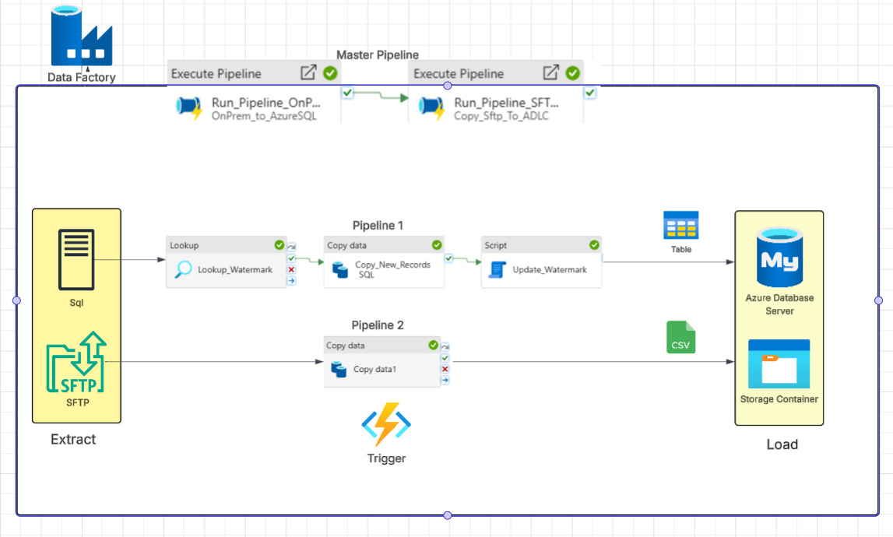
</p>


## Pipelines Overview

* **Pipeline 1**: `Run_Pipeline_OnPrem_To_SQLDB`
  Transfers data from **on-premise SQL Server** to **Azure SQL DB**

* **Pipeline 2**: `Run_Pipeline_SFTP_To_ADLS`
  Transfers files from **SFTP Server** to **Azure Data Lake Storage**

* **Master Pipeline**: Combines both pipelines and adds a **monthly trigger**


## Setup: Data Sources

### On-Premise SQL Server

* Set up using **SSMS (SQL Server Management Studio)**
* Loaded NYC Restaurant data locally

### SFTP Server

* Configured using **WinSCP**
* Contains **3 CSV files split by year** from the main dataset


## Load Targets

### Azure SQL Database

* Created in the `week6` resource group
* Used to load cleaned and transformed data

### Azure Data Lake Storage (ADLS)

* Two folders:

  * `SFTP-DATA`
  * `Restaurant_Inspection`


## 🚀 Pipeline 1: On-Premise SQL Server → Azure SQL Database

<p align="center">
  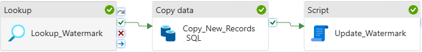
</p>

### 1. Linked Services

* **On-Premise SQL Server** (via Self-Hosted Integration Runtime)
* **Azure SQL Database**

<p align="center">
  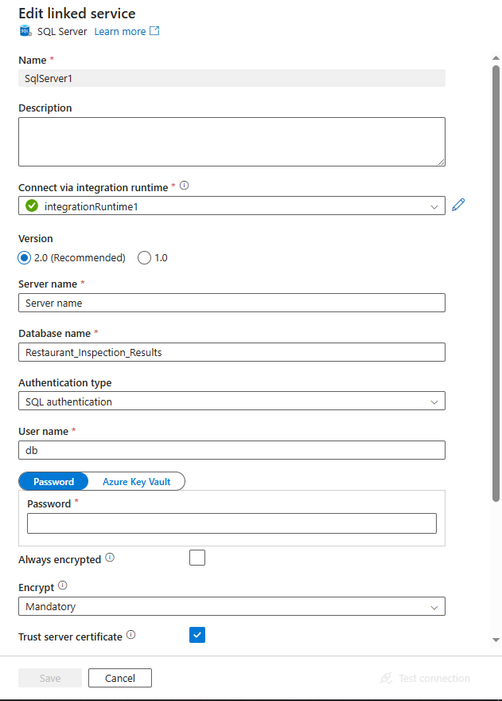
  
</p>

---

### 2. Datasets

* Source: `sqlservertable1`
* Sink: `azuresqltable1`

<p align="center">
  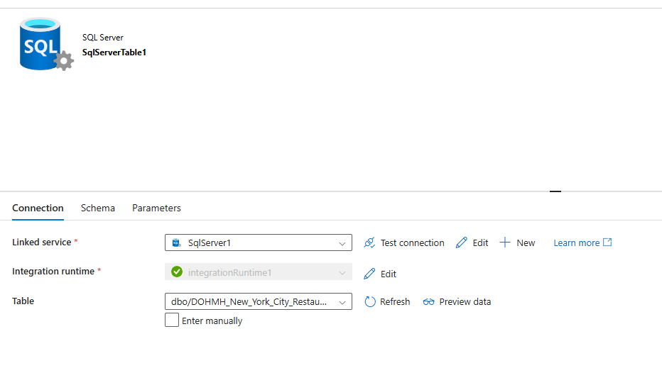
  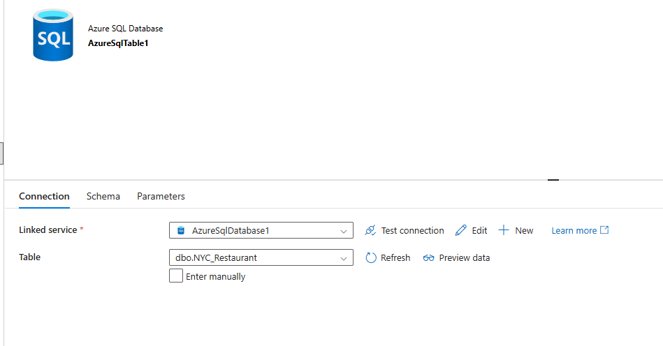
</p>

---

### 3. Incremental Load Logic

We use a **watermark table** to capture and filter new/updated data using **Lookup + Filter** logic.

#### Step 1: Lookup Watermark

```sql
SELECT MAX([INSPECTION DATE]) AS last_watermark
FROM dbo.NYC_Restaurant
```

#### Step 2: Filter New Records

```sql
SELECT *
FROM dbo.DOHMH_New_York_City_Restaurant_$
WHERE [INSPECTION DATE] > '@{activity('Lookup_Watermark').output.firstRow.last_watermark}'
```

#### Step 3: Update Watermark Table

```sql
UPDATE watermark_table
SET last_updated_time = (
    SELECT MAX([INSPECTION DATE])
    FROM dbo.NYC_Restaurant
)
WHERE table_name = 'NYC_NYC_Restaurant';
```

---

### ✅ Pipeline 1 Result

<p align="center">
  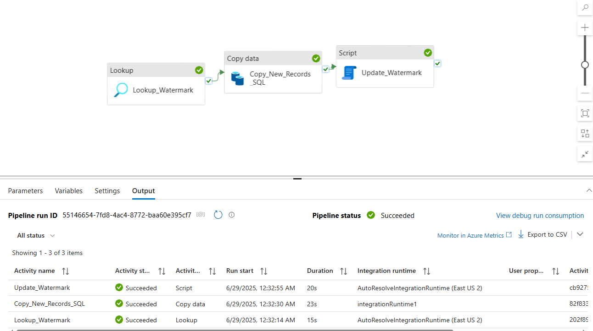
  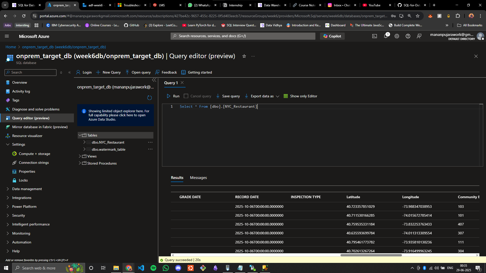
</p>


## 📦 Pipeline 2: SFTP Server → Azure Data Lake Storage

<p align="center">
  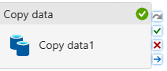
</p>

### 1. Linked Services

* **SFTP Server** (connected via SHIR)
* **ADLS Gen2**

<p align="center">
  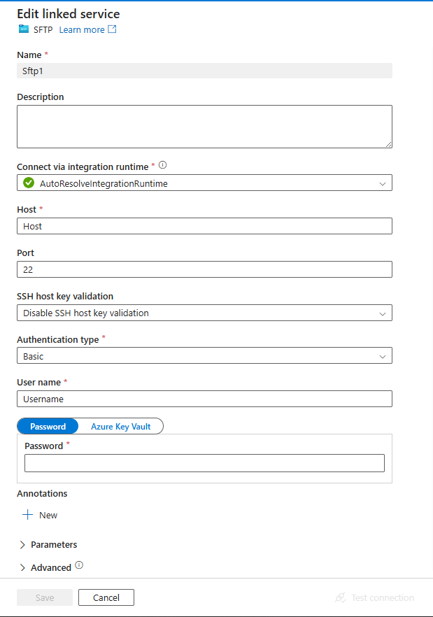
  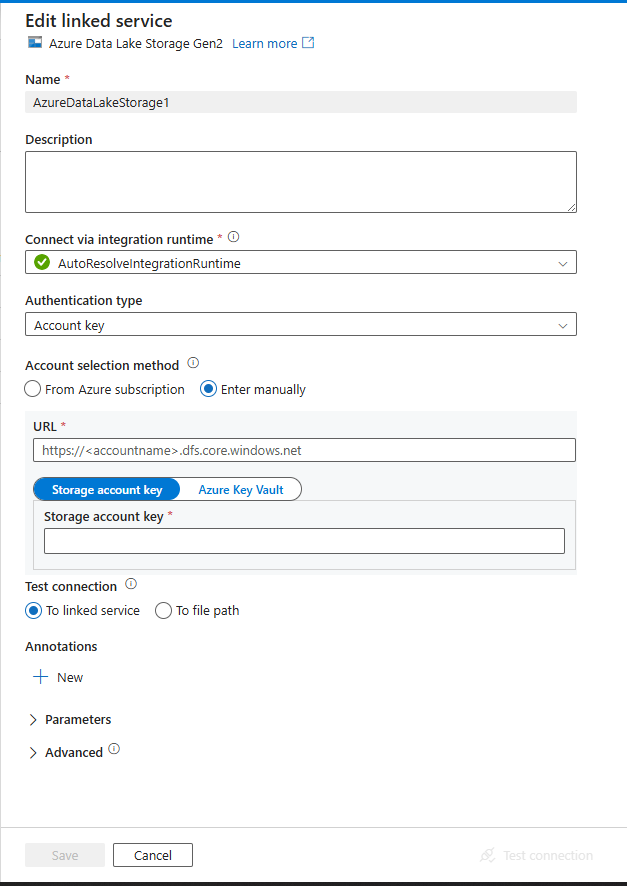
</p>


### 2. Datasets

* Source: CSV files from SFTP
* Sink: ADLS folders

<p align="center">
  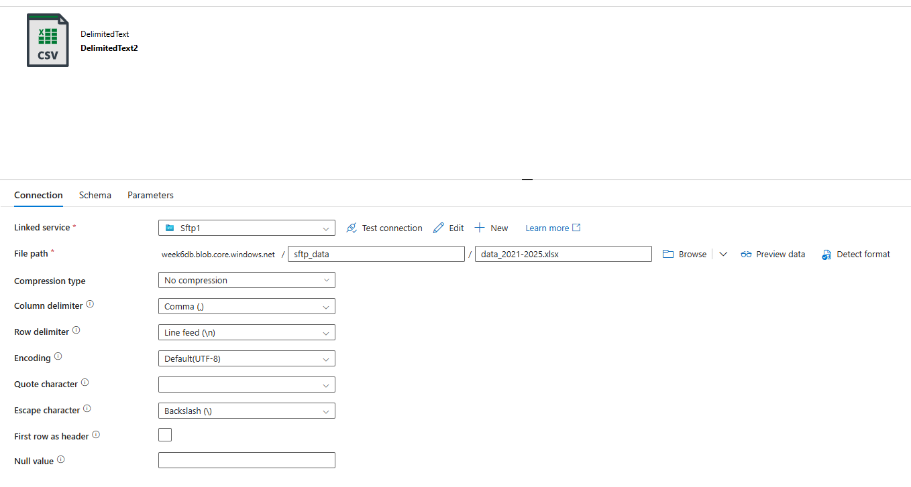
  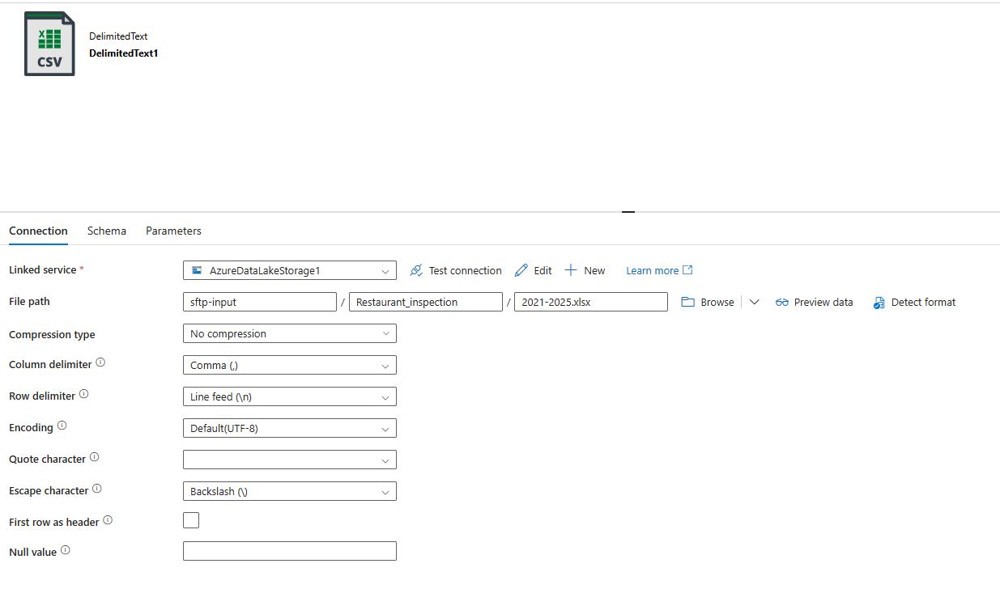
</p>


### 3. Copy Activity

* Source: SFTP files
* Destination: ADLS folders

💡 You can enhance this pipeline with incremental logic using a **watermark + metadata table**, just like in Pipeline 1.


### ✅ Pipeline 2 Result

<p align="center">
  
  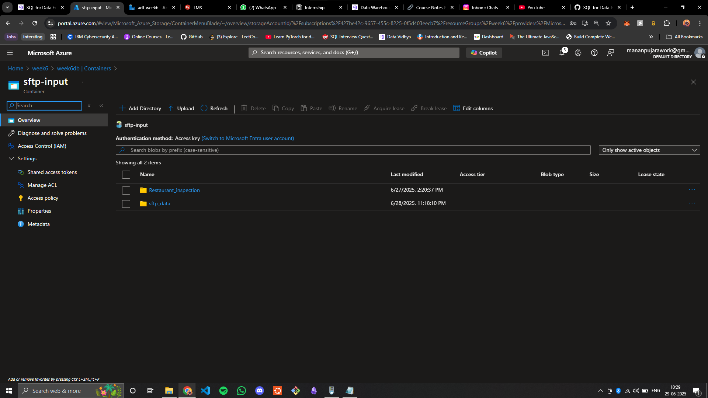
  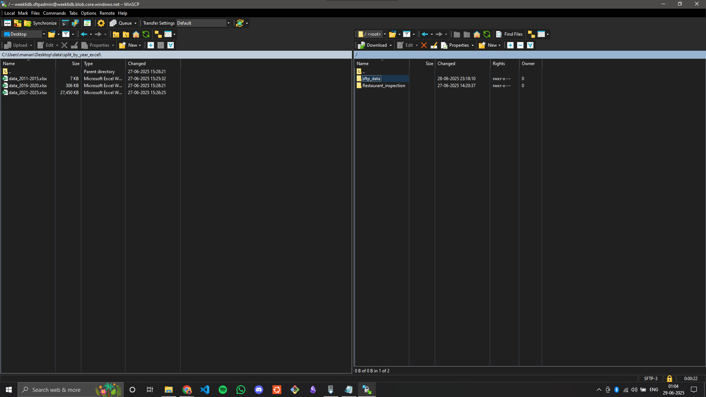
  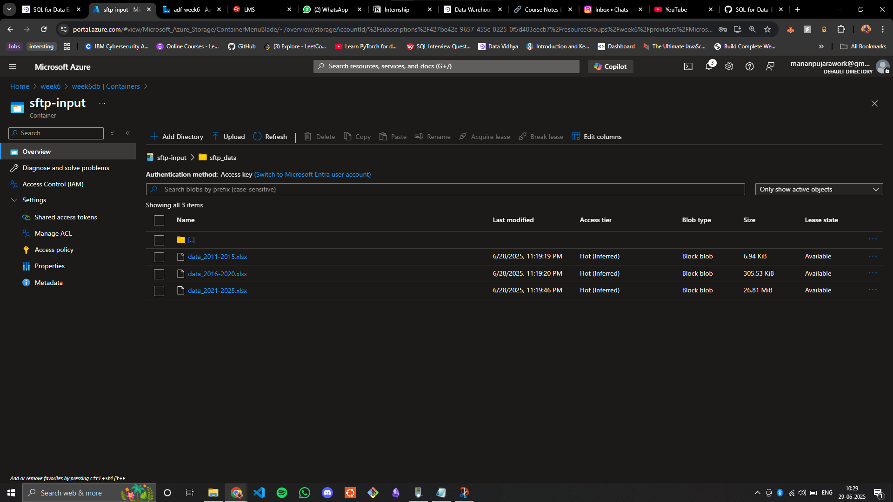
</p>


## 🧠 Master Pipeline + Trigger

<p align="center">
  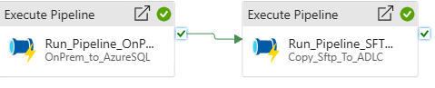
</p>

* Combines Pipeline 1 and Pipeline 2
* Adds a **trigger** to run on the **last Saturday of every month** at **7 AM**

### Trigger Configuration:

<p align="center">
  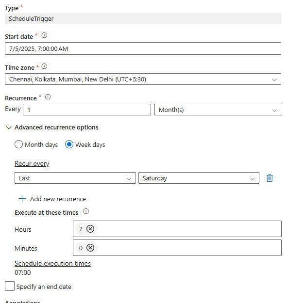
</p>

* **Recurrence**: Monthly
* **Week Days**: Saturday
* **Week of Month**: Last
* **Time**: 7:00 AM

---

### ✅ Trigger Run Result

<p align="center">
  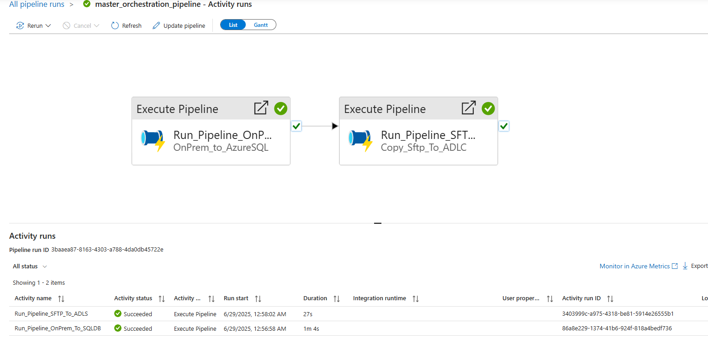
</p>

---

## ✅ Summary

| Task                      | Status |
| ------------------------- | ------ |
| On-Prem to Azure SQL DB   | ✅ Done |
| SFTP to ADLS Gen2         | ✅ Done |
| Incremental Load Logic    | ✅ Done |
| Master Pipeline + Trigger | ✅ Done |

This was a hands-on and valuable experience with **Azure Data Factory**, simulating a real-world ETL workflow using multiple sources, destinations, and automation logic!
